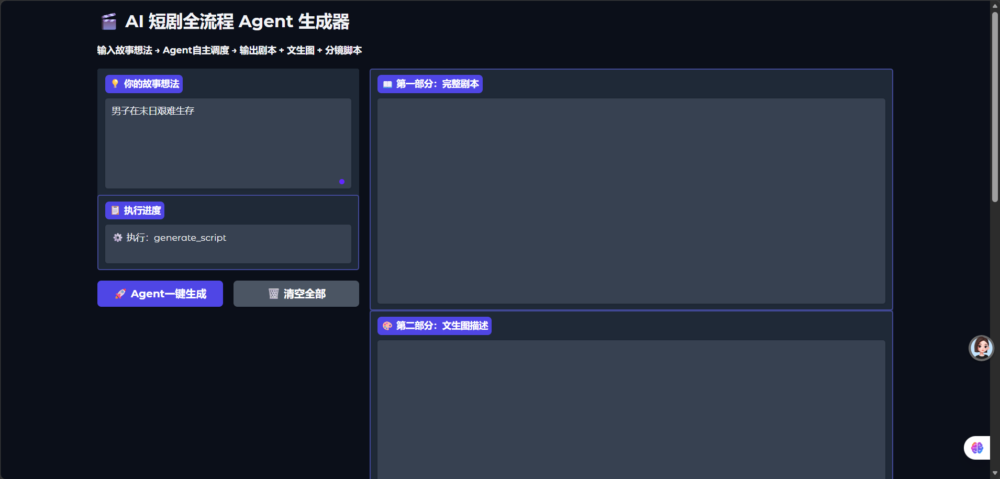
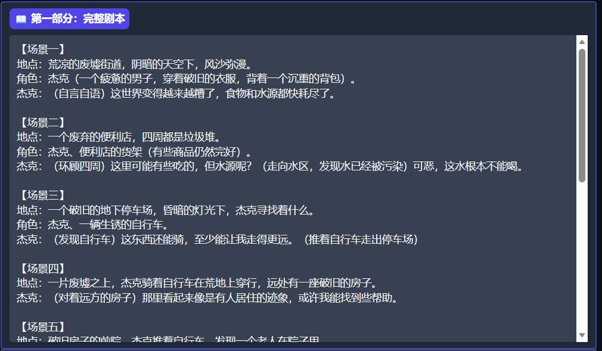
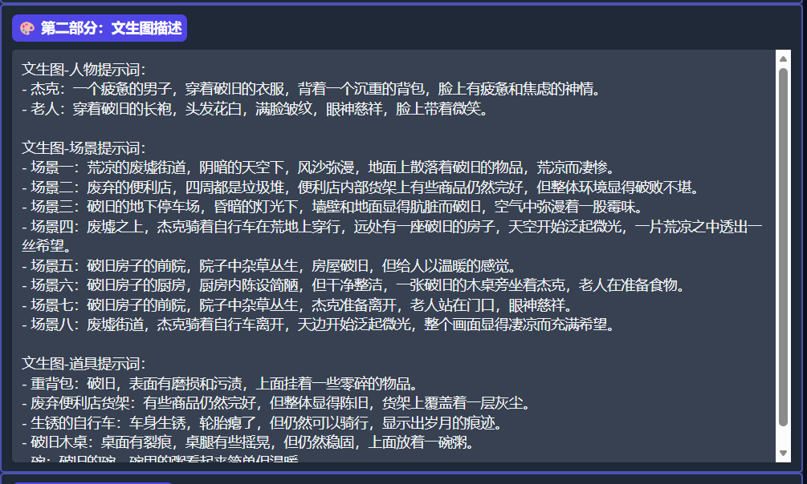
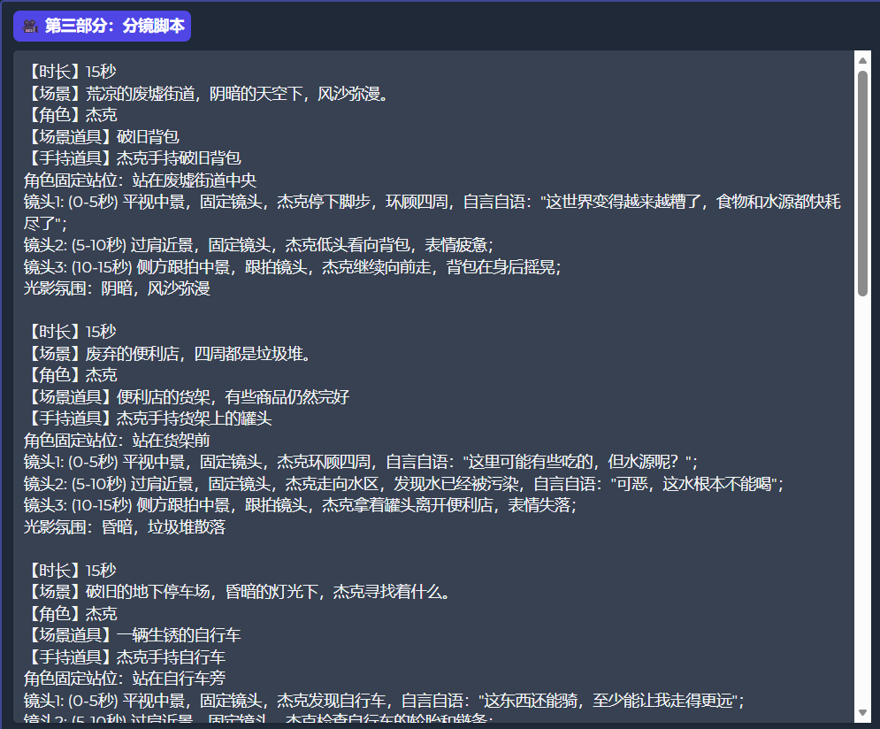

# AI短剧全流程Agent生成器
> 输入一句话想法 → Agent自主调度 → 输出剧本 + 文生图描述 + 分镜脚本

## 项目简介
基于大模型Function Calling实现的多步骤Agent应用。用户只需输入一个故事想法，系统自动完成：
- 生成完整短剧剧本（8个场景，1500-2000字）
- 生成文生图描述词（人物/场景/道具）
- 生成标准化分镜脚本（6-8个单元，每单元3个镜头，覆盖1.5-2分钟视频时长）

## 技术栈
| 技术 | 说明 |
|---|---|
| Python 3.10 | 核心开发语言 |
| Gradio | Web可视化交互界面 |
| 硅基流动 API | Qwen/Qwen2.5-32B-Instruct 大模型 |
| Function Calling | 工具调度核心机制 |
| Prompt Engineering | 少样本（Few-shot）+ 思维链（CoT）提示词优化 |

## 核心设计：Agent自动调度范式
本项目依靠大模型Function Calling实现全自动多步骤执行：
1. **定义工具**：内置三套工具函数
   - `generate_script` 生成短剧剧本
   - `generate_visual_descriptions` 生成画面提示词
   - `generate_storyboard` 生成分镜脚本
2. **大模型自主决策**：模型判断任务进度，自动选择下一步调用工具
3. **本地程序执行**：后端运行工具，把产出文本回传给模型
4. **闭环循环**：完成「决策→执行→结果回传→下一步决策」完整Agent流程

## 运行效果





完整演示视频：[点击查看网盘录屏](通过网盘分享的文件：AI Agent视频.mp4
链接: https://pan.baidu.com/s/162d13KH-WiGVnALFkf8h3A?pwd=26b7 提取码: 26b7)

## 本地部署运行
### 1. 安装依赖
```bash
pip install gradio requests
